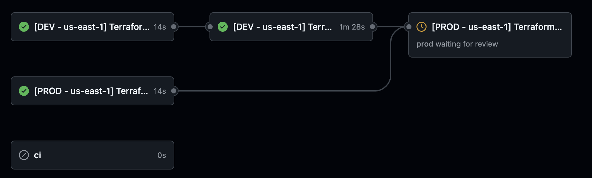
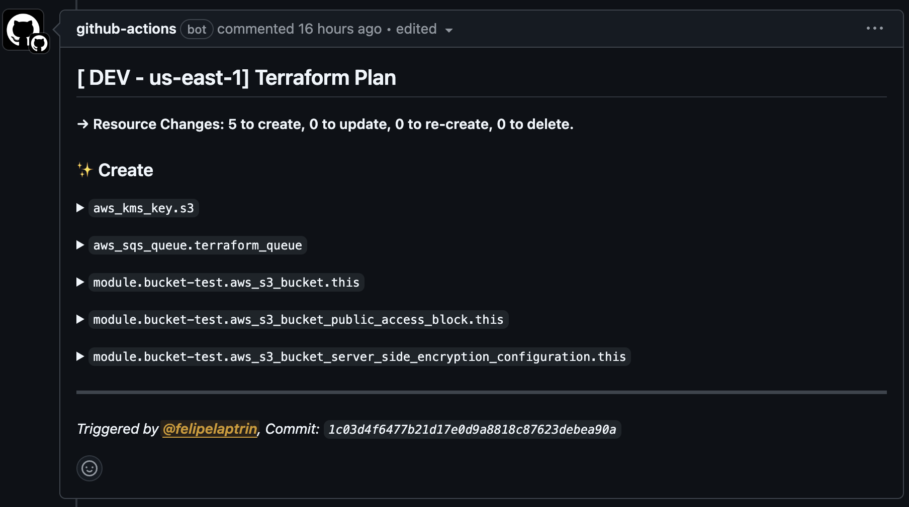

# Terraform CI/CD

This repository is a demo repository for my [blog post](https://felipetrindade.com/terraform-ci-cd).

## Development Environment
[Mise](https://mise.jdx.dev/configuration.html) is being used as a tool to set up a uniform development environment for all the developers in this project. All the needed dependencies to run the project are listed in the `.mise.toml` file, which becomes very handy because:
- **Dependencies as declarative**: The dependencies file serves as a manifest to list all the tools (and versions) required to run the project
- **Source of truth** The file serves as the source of truth for the repository, i.e. it can be reused in the CI/CD too, a single modification in this file affects everyone, everywhere. It's common to see CI/CD that hardcode the version of Terraform to install, this approach removes this.

## GitHub Actions
GitHub Actions will be used as the tool to run the CI/CD pipeline.

### CI
The CI job will run during Pull Request and will be used to validate the Terraform configuration, security, and lint. The CI relies on running the `pre-commit` if the repo, this guarantees that even if the developer bypasses the pre-commit check, the CI will guarantee that the code is compliant with the best practices created for the repo. These are the actions that run in the pre-commit:
- `terraform fmt`: Make sure the code is formatted and easy to read.
- `terraform docs`: Automatically updates the README markdown that contains the documentation of the terraform code auto-generated by [terraform-docs](https://terraform-docs.io/)
- `terraform validate`:  Validate runs checks that verify whether a configuration is syntactically valid and internally consistent, regardless of any provided variables or existing state.
- `terraform providers lock`: Consults registries in order to write provider dependency information into the dependency lock file (`.terraform.lock.hcl`)
- `terraform tflint`: Uses [tflint](https://github.com/terraform-linters/tflint) to find possible errors and enforce best practices.
- `terraform trivy`: Find vulnerabilities, misconfigurations, and exposed secrets using [trivy](https://github.com/aquasecurity/trivy)

Also, during Pull Request we are checking the `Terraform Plan` that will be executed using [Terraform Plan Comment](https://github.com/borchero/terraform-plan-comment) action. This custom action adds a comment in the Pull Request with the additions/changes/deletions that will be performed.

### CD
The CD pipeline of this repository is responsible for deploying the infrastructure. We are deploying into two environments (Dev in us-east-1, Prod in us-east-1). Dev is deployed once the PR gets merged, while Prod is deployed after Dev is deployed and a manual approval is done. Notice that this is only achievable using [GitHub Environment](https://docs.github.com/en/actions/managing-workflow-runs-and-deployments/managing-deployments/managing-environments-for-deployment).